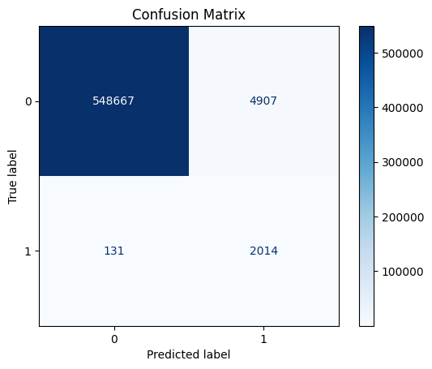

# MLops Pipelines For Real-time Credit Fraud Detection
---

**Description:** The goal of this project is to simulate a real-world credit banking system. It covers the full machine learning lifecycle, including feature engineering, algorithm selection, oversampling for class imbalance, precision–recall trade-off analysis, and model deployment. An XGBoost model was trained and deployed as a RESTful service using a Flask API, then containerized with Docker for scalability. To handle data drift, the system starts computing the Population Stability Index (PSI) each time the data volume increases by 20%. If the PSI exceeds 0.3, it automatically triggers model retraining.

## 1/ Overview:
Just imagine you are a normal customer at PNC Bank.
Your credit card life is very predictable: you just use it to order food online, usually under $70, and you’re loyal to your hometown (you basically never leave it). If your credit card had a personality, it would be "boring but reliable".

Then one night, at 2:45 AM, while you’re peacefully asleep, your credit card decides it’s time for an adventure.

💥 $6,350 spent at an online electronics store.

💥 Another big purchase a few minutes later.

💥 Both occurring nearly 1000 miles apart.

The fraud detection system at PNC then raises an eyebrow.

“This doesn’t look like our late-night pizza order…”

Within seconds, the system flags the transactions, blocks the card, and sends you a message asking if you’ve somehow turned into a midnight tech enthusiast. You reply NO, your card is saved, and your credit card goes back to its quiet, food-ordering life.

**=> It is an example of how a fraud detection system in the real world works. And this repository contains everything to simulate a system like that.**

## 2/ Model Development: ##

### a) Algorithm Selection

To tackle this fraud detection challenge, I turn to my trusted ally:

  <strong>XGBoost, I choose you! ⚡</strong>

  

**Why do I choose XGBoost?**
Simply because of its efficiency. Just imagine that a single false negative can result in a $10,000 loss for your customer.
Trusting such a task to a simple KNN model?
**Hear me out, bro. That should be illegal 🙃.**

I’m not saying KNN or Logistic Regression are bad algorithms, they just aren’t production-ready.
A system receives more and more data every day, while KNN tends to overfit on large datasets.
As for Logistic Regression, the model performs well only if the data satisfies certain assumptions, such as a linear relationship, which is very rare in real-world scenarios.

### b) Feature Engineering ###

This is the dataset I used for this project. You can download it from [here](https://www.kaggle.com/datasets/kartik2112/fraud-detection).

When my model was in the notebook, I used to think that good features are the ones most correlated with the target feature. 
But in production, real-time availability matters more.
I mean, come on, you can’t use *next_transaction_amount* in the real world, can you? 

And here are the features I used. I have classified them into three types:

**Tracking Features:** 
I’m not sure if this is the right name. These features are used to track transactions and to generate other online features. They are not used for training the model. The tracking features include:

- **cc_num:** Unique identifier for each customer. 
- **trans_date_trans_time:** The time at which a user makes a transaction. In this simulation, this feature is automatically retrieved from the user’s system clock when they click **“Send Money”**.
- **Merchant:** Who gets the money from the transaction.

**Offline Features:** The user provides the system with these features while making a transaction.

- **category**: The category of the transaction, such as personal care, food and dining, etc.
- **amt**: The total amount of the transaction.
- **lat** and **long**: The geographic coordinates of the user when making a transaction.  
  In a real system, this information would be retrieved via the user's GPS.  
  In this simulation, the coordinates are randomly generated when the user clicks "Send Money".
- **merch_lat** and **merch_long**: The geographic coordinates of the recipient. Just like lat and long, they are generated randomly.  

**Online Features:** We cannot track or ask customers to provide these features. They are generated automatically as the user makes transactions.

- **amt_pre**: The total amount of the user’s previous transaction.
- **lat_pre** and **long_pre**: The geographic coordinates of the user when making the previous transaction.
- **merch_lat_pre** and **merch_long_pre:** The geographic coordinates of the recipient when making the previous transaction.
- **pre_mer**: Indicates whether the current transaction is made at the same merchant as the previous transaction: 1 if the merchant is the same, 0 otherwise.
- **time_last_trans**: Time since the previous transaction, in seconds.
  
### c) Oversampling with SMOTE ###
The training set contains **1,296,675** transactions, of which only **7,506** are fraudulent, indicating a severe class imbalance. To address this issue, I adjust the **scale_pos_weight** parameter in the XGBoost model. This parameter is set as the ratio of the number of negative samples to the number of positive samples.

`scale_pos_weight = Total Negative Samples / Total Positive Samples  
= 1,296,675 / 7,506 ≈ 172`

Setting **scale_pos_weight = 172** increases the penalty for misclassifying fraudulent transactions relative to non-fraudulent ones, encouraging the model to pay more attention to the minority class during training.

### d) Evaluation ###

Evaluating a machine learning model is an art. Achieving 100% accuracy on the test set is far less important than estimating how the model will perform in the real world. Let’s break down how the model may fail:

- **The model predicts a fraud transaction as non-fraud (False Negative):** Scammers love this. In this case, our customers lose their money. From the company’s perspective, failing to handle fraud cases can also lead to legal exposure.
- **The model predicts a non-fraud transaction as fraud (False Positive):** Customers may be annoyed by the extra friction, but no financial loss occurs since the transaction can be released once the customer confirms it.
  
**=> This is clearly a trade-off between financial loss and customer experience. In this case, my business sense tells me to minimize false negatives and accept more friction if necessary, therefore optimizing recall over precision is my priority.**

              precision    recall  f1-score   support

           0       1.00      0.99      1.00    553574
           1       0.29      0.94      0.44      2145

    Accuracy                           0.99    555719

  

With **a recall of 94% for class 1**, we can be confident that the model is doing a good job detecting fraud transactions. But is it worth the trade-off?

**=> The answer is likely NO.** Let’s look at the cost. Based on the confusion matrix, **5,916** out of **553,574** legitimate transactions are incorrectly classified as fraud (False Positives). This results in **a False Positive Rate of (5916/553574)×100 ≈ 1.07%**.

**=> In a real-world system, the false positive rate should ideally be around 0.1 or lower. However, a model that looks good in a notebook does not mean it will survive in production. My philosophy is simple: deploy first, fine-tune later.**

## 3/ Machine Learning Operations (MLOps): ##

Now, it's time to take the model out of the notebook. 

The system is packaged and deployed using **Docker**. 

  

This is the complete MLOps pipeline for my credit fraud detection system:

- **User -> Flask API:** The user sends a transaction request to the Flask API, which includes tracking and offline features such as *cc_num, merchant, category,* and *amt*.
The *trans_date_trans_time* is obtained from the user’s system clock. For *lat, long, merch_lat,* and *merch_long*, the values are generated randomly. In a real-world system, these geographical features would be obtained from the user and merchant GPS.
- **Flask API <-> MySQL Database:** Online features are computed by querying the database with *cc_num* to retrieve the user’s transaction history.
- **Flask API <-> XGB Model:** After computing the online features, the API combines them with the offline features and sends the full feature set to the model.
The model then returns a prediction: fraud or non-fraud.
- **Flask API -> User:** The Flask API receives the prediction from the model and decides whether to accept the transaction (non-fraud) or deny it (fraud).
- **Model Monitoring:** A JSON file is initialized to store the baseline transaction volume.
When the total number of transactions exceeds the baseline by 20%, the system updates the baseline in the JSON file and computes the average PSI across features.
If the average PSI is greater than 0.3 (data drift), automatic model retraining is triggered.
- **Model retraining:** The model is retrained on both old and new data in a blind retraining process.
A limitation of this approach is temporal data leakage. Therefore, manual model evaluation is still required every 3–6 months.
